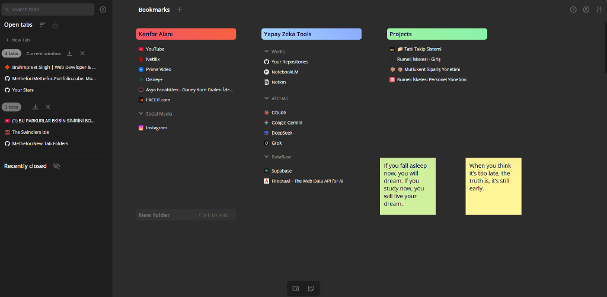
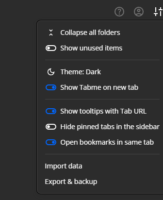
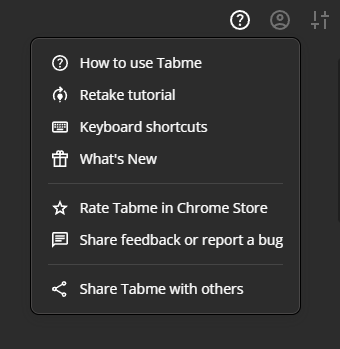

# 📁 New Tab Folders - Professional Bookmark Manager

**Organize your digital life with a premium, tabme-inspired bookmark manager for Chrome.**



---

## 🎯 Elevate Your Productivity

New Tab Folders transforms your "New Tab" page into a powerful workstation. Say goodbye to bookmark clutter and hello to a structured, aesthetic, and lightning-fast workspace.

### ✨ Core Features

*   **📂 Multi-Folder Organization**: Group your links into beautiful, color-coded cards.
*   **🖱️ Native Drag-and-Drop**: Save open tabs instantly by dragging them from the sidebar into any folder.
*   **🌓 Premium Themes**: Choose between Dark (Default), Light, Cyberpunk, and Nord themes.
*   **🌍 Global Localization**: Full support for Turkish, English, German, French, Portuguese, and Spanish.
*   **⚡ Smart Sidebar**: Search open tabs, view recently closed sessions, and manage your current window in one place.
*   **🛡️ Privacy First**: Your data stays on your device (Free) or syncs securely (Pro).

---

## 📸 Interactive Showcase

### 🛠️ Advanced Settings & Customization
Take full control of your workspace with our intuitive settings menu. Import/Export backups or clear data with one click.


### ❓ Comprehensive Documentation
Never get lost with our built-in Guide, featuring smooth navigation and detailed installation steps.


---

## 🚀 Recent Updates (v1.54)

We've completely overhauled the interface to be cleaner and more powerful:
- **Tabme-Style Header**: Redesigned navigation with dropdown menus for Profile, Help, and Settings.
- **3D Workspace Depth**: Added glassmorphism and inset shadows for a premium visual feel.
- **Improved Sidebar**: Collapse the sidebar to focus on your folders, or use the new sorting logic (Recent, Position, Reverse).
- **Session Recovery**: Fixed bugs in Recently Closed tabs; now parses entire session windows efficiently.

---

## 📦 Installation

### For Users
1. Download the extension from the [Chrome Web Store](#) (Coming Soon).
2. Click **Add to Chrome**.
3. Open a new tab and start organizing!

### For Developers (Local Load)
1. Clone this repository:
   ```bash
   git clone https://github.com/Methefor/New-Tab-Folders.git
   ```
2. Open `chrome://extensions/` in your browser.
3. Enable **Developer mode** (top right).
4. Click **Load unpacked** and select the project folder.

---

## 📖 How to Use

1.  **Add a Folder**: Click the `+` icon on the dashboard or in the sidebar.
2.  **Save a Link**: Use the `Click to add` button within a folder, or simply **drag an open tab** from the left sidebar.
3.  **Customize**: Click the `Settings` icon to switch themes or the `Profile` icon to see Pro benefits.
4.  **Right-Click Actions**: Use right-click on the dashboard empty space to quickly add folders or sticky notes.

---

## 🔧 Tech Stack

- **Frontend**: Vanilla JavaScript (ES6+) - High performance, zero bloat.
- **Styling**: Modern CSS3 (Grid, Flexbox, Variable-based theming).
- **API**: Chrome Extension Manifest V3 (Latest standard).
- **Storage**: Chrome Storage sync/local & LocalStorage.

---

## 🤝 Contributing & Support

We welcome feedback and bug reports! 
- **Report Bug**: Use the "Feedback" link in the Help menu.
- **Project Link**: [https://github.com/Methefor/New-Tab-Folders](https://github.com/Methefor/New-Tab-Folders)

Made with 💚 by **METHEFOR**
