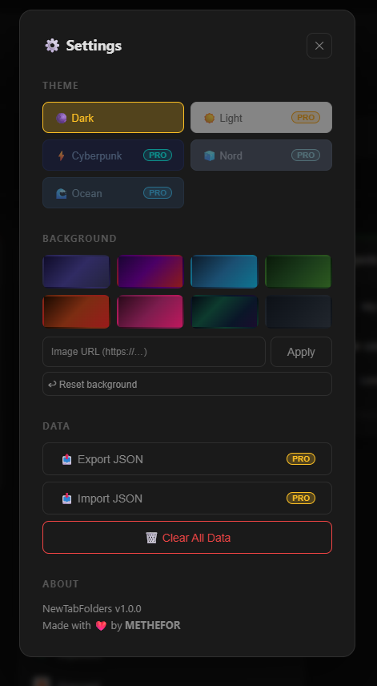

<div align="center">


# NewTabFolders

**Your new tab. Your workspace. Your way.**

Transform every new tab into a beautiful, high-performance productivity dashboard — with folders, bookmark management, web search, live widgets, and cloud sync.

[](https://chromewebstore.google.com/detail/newtabfolders/oghlifenjhpbebcdeboejbmemelkfobe)
[](https://github.com/Methefor/New-Tab-Folders/releases)
[](LICENSE)
[](https://methefor.lemonsqueezy.com)

---

.png)

</div>

---

## ✨ Why NewTabFolders?

Every day you open dozens of new tabs. Most people waste that screen real estate on a blank page or a generic search box. **NewTabFolders turns it into a command center** — your bookmarks, open tabs, pinned shortcuts, live weather, web search, and personal notes, all in one beautiful view.

No backend. No tracking. No bloat. Everything loads in **under 50ms**.

---

## 🎯 Feature Overview

### 📁 Folder & Bookmark Management
| Feature | Free | Pro |
|---------|:----:|:---:|
| Bookmark folders with custom colors & emojis | ✅ | ✅ |
| Drag & drop reordering | ✅ | ✅ |
| Folder templates (Work, Reading, Social, AI Tools) | ✅ | ✅ |
| Starter Packs (Remote Worker, Student) | ✅ | ✅ |
| Starter Packs (Cinema, Influencer, Gamer) | — | ✅ |
| Unlimited folders | up to 5 | ✅ |
| Pin folders to top | ✅ | ✅ |
| Duplicate link warning | ✅ | ✅ |
| Broken link checker | ✅ | ✅ |
| Tags + notes on bookmarks | ✅ | ✅ |

### 🔄 Tab Management
| Feature | Free | Pro |
|---------|:----:|:---:|
| Live sidebar with all open tabs | ✅ | ✅ |
| Drag tabs into bookmark folders | ✅ | ✅ |
| Stash all tabs to a new folder | ✅ | ✅ |
| Import Chrome Tab Groups as folders | ✅ | ✅ |
| Import Chrome Bookmarks (bulk) | — | ✅ |
| Close duplicate tabs | ✅ | ✅ |
| Recently closed tab recovery | ✅ | ✅ |

### 🔍 Web Search Bar
- Built-in search bar on every new tab
- Switch between **Google, Bing, DuckDuckGo, YouTube** with one click
- Remembers your preferred engine across sessions

### 📊 Live Widgets
- **Clock & Greeting** — Personalized time-based greeting (Good morning / Good evening)
- **Live Weather** — Real-time temperature & conditions via your location (Open-Meteo, no API key needed)

### ⚡ Quick Access & Visit Tracking
- **📌 Pin any bookmark** to the Quick Bar for instant one-click access
- **Most Visited** section auto-surfaces your most clicked links
- Click counts tracked locally — no data leaves your device

### 🎨 Themes & Custom Backgrounds
| Theme | Free | Pro |
|-------|:----:|:---:|
| 🌑 Dark | ✅ | ✅ |
| ☀️ Light | — | ✅ |
| ⚡ Cyberpunk | — | ✅ |
| 🧊 Nord | — | ✅ |
| 🌊 Ocean | — | ✅ |
| 🎨 Gradient backgrounds (8 presets) | — | ✅ |
| 🖼️ Custom image background (URL) | — | ✅ |

### ☁️ Cloud Sync (Pro)
- Sign in with Google to sync your workspace across all devices
- Real-time sync powered by Firebase Firestore — your folders are always up to date

### 🌍 6 Languages
Turkish · English · German · French · Portuguese · Spanish

### 🔒 Privacy First
- All data stored locally on your device (Free tier)
- No external analytics, no tracking, no ads
- Open source — inspect every line of code
- [Privacy Policy](https://methefor.github.io/New-Tab-Folders/privacy.html)

---

## 📸 Screenshots

<table>
  <tr>
    <td align="center"><b>Dashboard</b><br></td>
    <td align="center"><b>Folder Templates & Starter Packs</b><br></td>
  </tr>
  <tr>
    <td align="center"><b>Settings & Themes</b><br></td>
    <td align="center"><b>What's New</b><br></td>
  </tr>
</table>

---

## 💎 Pricing

| | **Free** | **Monthly** | **Yearly** | **Lifetime** |
|--|:---:|:---:|:---:|:---:|
| Price | $0 | $4.99/mo | $39.99/yr | $99.99 once |
| Folders | Up to 5 | Unlimited | Unlimited | Unlimited |
| Themes | Dark only | All 5 | All 5 | All 5 |
| Custom Backgrounds | — | ✅ | ✅ | ✅ |
| Cloud Sync | — | ✅ | ✅ | ✅ |
| Starter Packs (Pro) | — | ✅ | ✅ | ✅ |
| Priority Support | — | — | ✅ | ✅ |
| Lifetime Updates | — | — | — | ✅ |

> 💳 Secure payment via LemonSqueezy • 30-day money-back guarantee  
> 🔑 Already purchased? Enter your license key in the Pro modal to activate.

---

## 🚀 Getting Started

### Install from Chrome Web Store
1. [Install NewTabFolders](https://chromewebstore.google.com/detail/newtabfolders/oghlifenjhpbebcdeboejbmemelkfobe)
2. Open a new tab — your dashboard is ready instantly
3. Click `+` to create your first folder
4. Drag any open tab from the sidebar into a folder

### Developer / Local Install
```bash
git clone https://github.com/Methefor/New-Tab-Folders.git
```
1. Open `chrome://extensions/`
2. Enable **Developer mode** (top right toggle)
3. Click **Load unpacked** → select the project folder
4. Open a new tab ✨

---

## ⌨️ Keyboard Shortcuts

| Shortcut | Action |
|----------|--------|
| `Ctrl` + `Z` | Undo last deletion |
| `Esc` | Close any dialog |
| `Shift` + Click | Multi-select bookmarks |
| `Double-click` | Rename folder inline |
| `Shift` + `Alt` + `P` | Activate 7-day Pro demo |

---

## 🛠️ Tech Stack

```
Frontend:   Vanilla JavaScript (ES6+) — zero dependencies, <50ms load
Styling:    CSS3 Custom Properties — theme system, glassmorphism
Extension:  Chrome Manifest V3 (latest standard)
Storage:    Chrome Storage API + localStorage
Sync:       Firebase Firestore (Pro)
Payments:   LemonSqueezy (license key activation)
Weather:    Open-Meteo API (free, no key required)
```

---

## 📁 Project Structure

```
New-Tab-Folders/
├── index.html          # New tab page (main app)
├── pricing.html        # Pricing & upgrade page
├── guide.html          # User guide
├── changelog.html      # What's new / release notes
├── privacy.html        # Privacy policy
├── manifest.json       # Chrome Extension manifest v3
├── css/
│   └── styles.css      # Full theme system + all component styles
├── js/
│   ├── app.js          # Core app logic
│   ├── background.js   # Service worker (MV3)
│   ├── sync.js         # Firebase cloud sync (Pro)
│   ├── info-page.js    # Guide & changelog page logic
│   └── translations.js # i18n strings (6 languages)
├── assets/
│   ├── icons/          # Extension icons (16, 48, 128px)
│   └── screenshots/    # README screenshots
└── store-assets/       # Chrome Web Store listing assets
```

---

## 🗺️ Roadmap

- [ ] Firefox & Edge support
- [ ] Mobile companion app
- [ ] AI-powered bookmark suggestions
- [ ] Folder sharing with team members
- [ ] Browser history integration
- [ ] More widget types (Calendar, To-Do, RSS)

---

## 🤝 Contributing

Bug reports and feature suggestions are welcome!

- **Report a bug**: Use the Feedback button inside the extension
- **Feature request**: [Open an issue](https://github.com/Methefor/New-Tab-Folders/issues)
- **Pull requests**: Fork → branch → PR

---

## 📄 License

MIT License — see [LICENSE](LICENSE) for details.

---

<div align="center">

Made with ❤️ by [**METHEFOR**](https://github.com/Methefor)

⭐ If NewTabFolders saves you time, please give it a star — it helps a lot!

[](https://github.com/Methefor/New-Tab-Folders)

</div>
